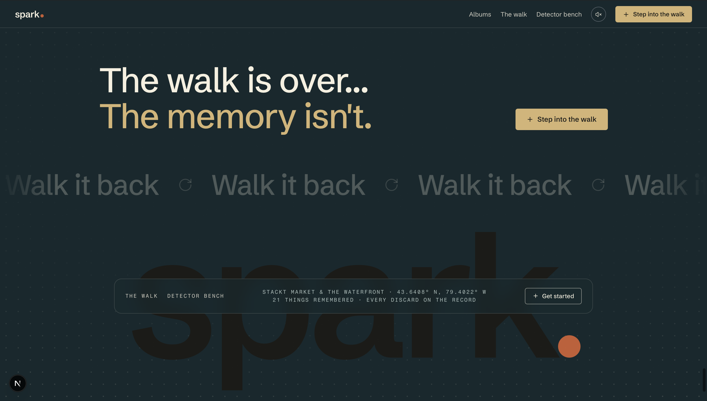
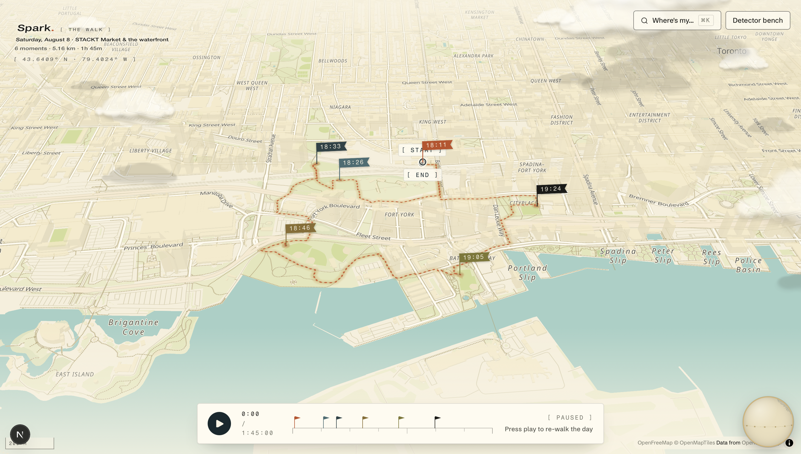
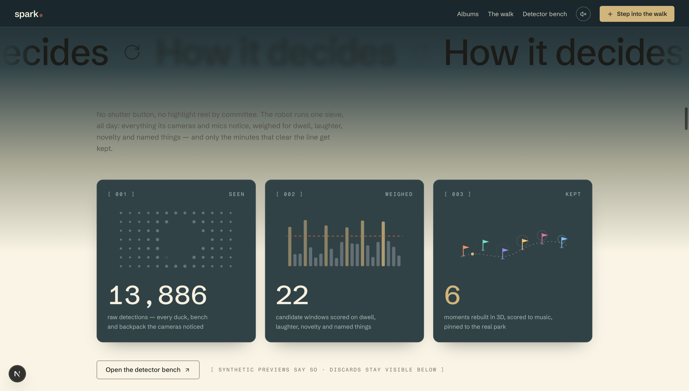
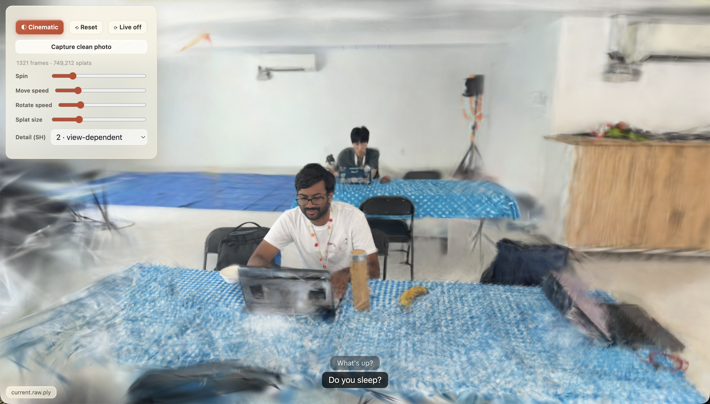
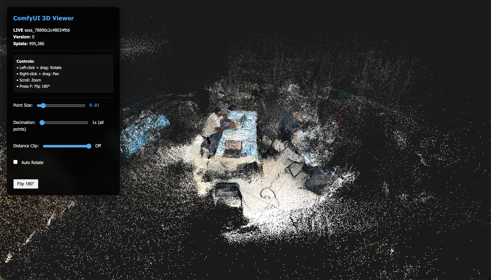
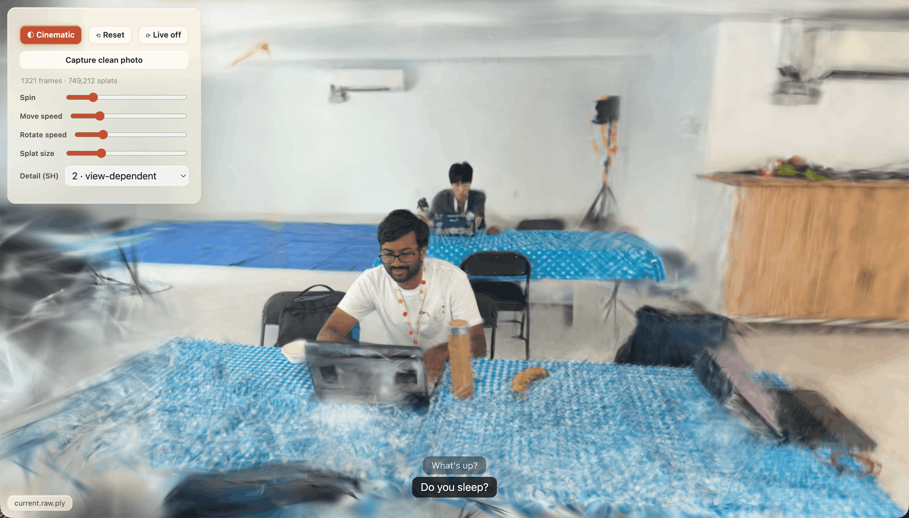
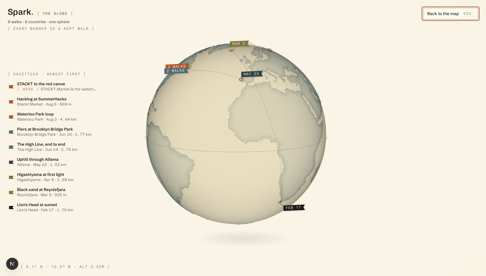
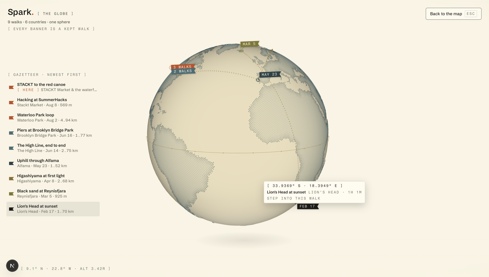

# Spark

<p align="center"><em>The walk is over… the memory isn't.</em></p>

<p align="center">
  
</p>

**Spark is a companion robot that follows you on a walk, decides on its own what was worth
keeping, and lets you relive the trip afterwards.** Named for the spark that makes a moment
a moment.

An iPhone + speaker rides on the robot. It watches and listens while you walk, captures the
moments that matter without being asked, reconstructs them as 3D Gaussian splats you can poke
around, plays a track that fits the mood, and remembers where you left things.

---

## The walk

Every kept walk becomes a full-screen replay: the real route on real OpenStreetMap sidewalks,
each remembered moment pinned to the exact spot and minute it happened. Press play and the day
re-walks itself.

<p align="center">
  
</p>

## How it decides

No shutter button, no highlight reel by committee. The robot runs one sieve all day —
everything its cameras and mics notice is weighed for dwell, laughter, novelty and named
things, and only the minutes that clear the line get kept. On the demo walk that was
**13,886 raw detections → 22 scored candidate windows → 6 kept moments**, and the discards
stay visible in the detector bench so the reasoning can be audited from any screen.

<p align="center">
  
</p>

## Step into a moment

Each kept moment is reconstructed as a Gaussian splat — a walkable 3D photograph. Fly through
it, hear what was said, capture a clean photo from any angle.

<p align="center">
  
</p>

Behind that viewer is the live capture pipeline: the iPhone streams RGB + pose + LiDAR depth
to a Mac, which fuses it into a point cloud you can watch grow in real time, then trains it
into the finished splat.

<table>
  <tr>
    <td width="50%"></td>
    <td width="50%"></td>
  </tr>
  <tr>
    <td align="center"><sub>During the walk — the raw point cloud, live</sub></td>
    <td align="center"><sub>After training — the finished splat</sub></td>
  </tr>
</table>

## The globe

Walks accumulate. Zoom out from any map and the atlas becomes a pocket globe — every banner a
kept walk, every dotted arc a trip between them.

<table>
  <tr>
    <td width="50%"></td>
    <td width="50%"></td>
  </tr>
  <tr>
    <td align="center"><sub>9 walks · 6 countries · one sphere</sub></td>
    <td align="center"><sub>Hover a banner to step into that walk</sub></td>
  </tr>
</table>

---

## The three parts

| Path | What it is | Language |
|---|---|---|
| [`ios/`](ios/) | On-robot capture — ARKit/LiDAR recorder for iPhone 16 Pro, streams RGB + pose + depth | Swift / SwiftUI |
| [`tools/`](tools/) | Mac-side pipeline — live capture server, ESP32 odometry, video → Gaussian splat | Python |
| [`web/`](web/) | The day as a full-screen map of splat moments + the detection → moment pipeline | TypeScript / Next.js |

They meet in two places:

- **Splats.** `tools/video_intel` produces `.ply`/`.spz` files. Drop one in
  `web/public/mock/splats/` and set `url` on the moment's `splat` — the web viewer switches
  from its synthetic preview to the real reconstruction with no code change.
- **Detections and moments.** `web/` exposes `POST /api/ingest/detections` and
  `POST /api/ingest/moments`, both validating against the contract in `web/lib/types.ts`.
  That's the seam the robot posts through.

## Start here

- **Web app** → [`web/README.md`](web/README.md). `cd web && npm install && npm run dev`.
  Read `web/lib/types.ts` first: it's the `Detection → MomentCandidate → Moment` contract
  everything downstream codes against.
- **Capture pipeline** → [`SETUP.md`](SETUP.md) for prerequisites and how to run it, then
  [`docs/README_GAUZENSPLAT_CAPTURE.md`](docs/README_GAUZENSPLAT_CAPTURE.md) for the what/why
  and [`docs/IMPLEMENTATION_STATUS.md`](docs/IMPLEMENTATION_STATUS.md) for what's built and
  tested.
- **iOS app** → [`ios/README.md`](ios/README.md).

## Repo layout

```
ios/      Swift capture app (XcodeGen — run `xcodegen generate` first)
tools/    Python: arkit_capture · live_capture_server · video_intel
web/      Next.js app: the day atlas (map + splat moments), ⌘K object search, detector bench
docs/     Capture-pipeline design docs, status, test reports
SETUP.md  Capture-pipeline setup
LICENSE   MIT
```

## Two things that aren't in git

- **`ComfyUI/`** — the Gaussian-splat trainer (Brush + `pipeline_run.py`) is an external
  dependency expected at the repo root. Tens of GB, deliberately not vendored. Everything
  except the actual splat-training step runs from a fresh clone. See `SETUP.md`.
- **`web/Journey Moment Capture App/`** — the Figma Make export the web design came from.
  Kept locally as a visual reference; it's a separate Vite app and not part of any build.

## State of things

`web/` is green on `npm run typecheck`, `npm run lint` and `npm run verify` — the last of
which asserts that the trip-replay data is internally consistent (every moment traces to a
promoted candidate, every candidate to detections inside its window). Run it after touching
anything in `web/lib/`.

The capture pipeline's Python suites pass without hardware (~102 tests); the iPhone/ESP32
paths are documented as awaiting hardware in
[`docs/IPHONE_LIDAR_CAPTURE_TEST_REPORT.md`](docs/IPHONE_LIDAR_CAPTURE_TEST_REPORT.md).

## License

MIT — see [`LICENSE`](LICENSE).
